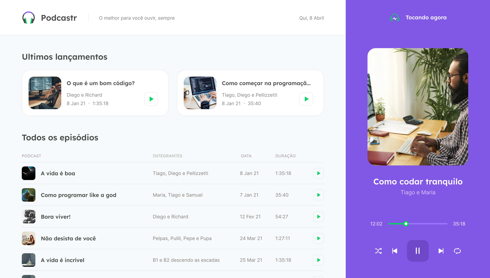

# Podcastr

Projeto da NLW.

<h4 align="center">
  
</h4>

## 🧪 Technologies

This project was developed using the following technologies:

- [Next.js](https://nextjs.org/)
- [React](https://reactjs.org)
- [TypeScript](https://www.typescriptlang.org/)

## 🚀 Getting started

Clone the project and access the folder

```bash
$ git clone https://github.com/guilhermecapitao/podcastr.git && cd podcastr
```

Follow the steps below
```bash
# Install the dependencies
$ yarn

# Run the JSON server
$ yarn server

# Start the project
$ yarn dev
```